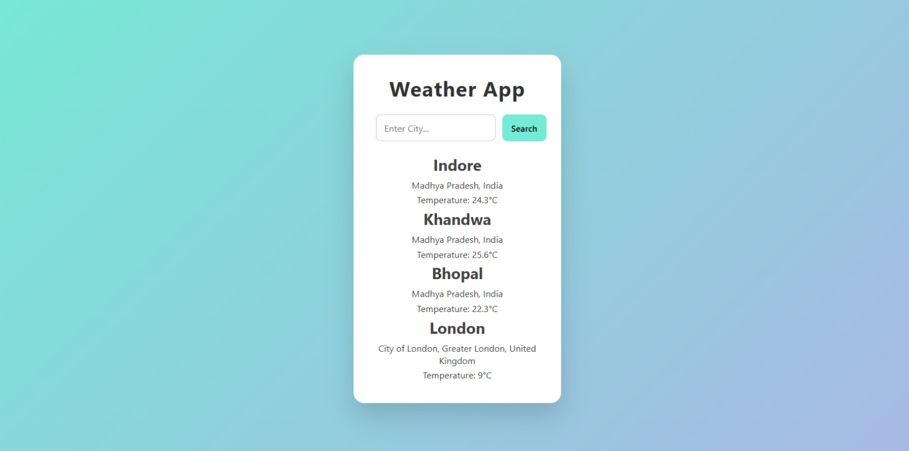

# 🌦️ Weather App

A simple and modern Weather Application built using **HTML, CSS, and JavaScript**.  
It allows users to search for any city and get real-time weather information using the **WeatherAPI**.

## 🚀 Features
- Search weather by city name  
- Fetch real-time data using Fetch API  
- Displays:
  - City name  
  - Region & Country  
  - Temperature (°C)  
- Clean and modern UI  
- Uses `async/await` for API handling  
- Error handling for empty input  

## 🛠️ Tech Stack
- HTML  
- CSS  
- JavaScript (ES6+)  
- WeatherAPI  
